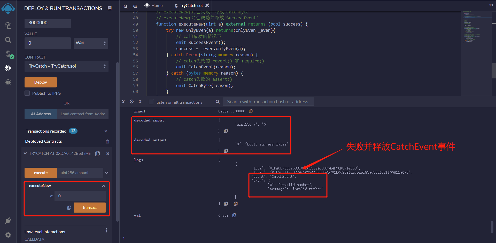

# WTF Solidity极简入门: 30. Try Catch

我最近在重新学solidity，巩固一下细节，也写一个“WTF Solidity极简入门”，供小白们使用（编程大佬可以另找教程），每周更新1-3讲。

欢迎关注我的推特：[@0xAA_Science](https://twitter.com/0xAA_Science)

欢迎加入WTF科学家社区，内有加微信群方法：[链接](https://discord.gg/5akcruXrsk)

所有代码和教程开源在github（1024个star发课程认证，2048个star发社群NFT）: [github.com/AmazingAng/WTFSolidity](https://github.com/AmazingAng/WTFSolidity)

-----

`try-catch`是现代编程语言几乎都有的处理异常的一种标准方式，`solidity`0.6版本也添加了它。这一讲，我们将介绍如何利用`try-catch`处理智能合约中的异常。

## `try-catch`
在`solidity`中，`try-catch`只能被用于`external`函数或创建合约时`constructor`（被视为`external`函数）的调用。基本语法如下：
```solidity
        try externalContract.f() {
            // call成功的情况下 运行一些代码
        } catch {
            // call失败的情况下 运行一些代码
        }
```
其中`externalContract.f()`是某个外部合约的函数调用，`try`模块在调用成功的情况下运行，而`catch`模块则在调用失败时运行。

同样可以使用`this.f()`来替代`externalContract.f()`，`this.f()`也被视作为外部调用，但不可在构造函数中使用，因为此时合约还未创建。

如果调用的函数有返回值，那么必须在`try`之后声明`returns(returnType val)`，并且在`try`模块中可以使用返回的变量；如果是创建合约，那么返回值是新创建的合约变量。
```solidity
        try externalContract.f() returns(returnType val){
            // call成功的情况下 运行一些代码
        } catch {
            // call失败的情况下 运行一些代码
        }
```

另外，`catch`模块支持捕获特殊的异常原因：

```solidity
        try externalContract.f() returns(returnType){
            // call成功的情况下 运行一些代码
        } catch Error(string memory /*reason*/) {
            // 捕获revert("reasonString") 和 require(false, "reasonString")
        } catch Panic(uint /*errorCode*/) {
            // 捕获Panic导致的错误 例如assert失败 溢出 除零 数组访问越界
        } catch (bytes memory /*lowLevelData*/) {
            // 如果发生了revert且上面2个异常类型匹配都失败了 会进入该分支
            // 例如revert() require(false) revert自定义类型的error
        }
```

## `try-catch`实战
### `OnlyEven`
我们创建一个外部合约`OnlyEven`，并使用`try-catch`来处理异常：
```solidity
contract OnlyEven{
    constructor(uint a){
        require(a != 0, "invalid number");
        assert(a != 1);
    }

    function onlyEven(uint256 b) external pure returns(bool success){
        // 输入奇数时revert
        require(b % 2 == 0, "Ups! Reverting");
        success = true;
    }
}
```
`OnlyEven`合约包含一个构造函数和一个`onlyEven`函数。

- 构造函数有一个参数`a`，当`a=0`时，`require`会抛出异常；当`a=1`时，`assert`会抛出异常；其他情况均正常。
- `onlyEven`函数有一个参数`b`，当`b`为奇数时，`require`会抛出异常。

### 处理外部函数调用异常
首先，在`TryCatch`合约中定义一些事件和状态变量：
```solidity
    // 成功event
    event SuccessEvent();

    // 失败event
    event CatchEvent(string message);
    event CatchByte(bytes data);

    // 声明OnlyEven合约变量
    OnlyEven even;

    constructor() {
        even = new OnlyEven(2);
    }
```
`SuccessEvent`是调用成功会释放的事件，而`CatchEvent`和`CatchByte`是抛出异常时会释放的事件，分别对应`require/revert`和`assert`异常的情况。`even`是个`OnlyEven`合约类型的状态变量。

然后我们在`execute`函数中使用`try-catch`处理调用外部函数`onlyEven`中的异常：

```solidity
    // 在external call中使用try-catch
    function execute(uint amount) external returns (bool success) {
        try even.onlyEven(amount) returns(bool _success){
            // call成功的情况下
            emit SuccessEvent();
            return _success;
        } catch Error(string memory reason){
            // call不成功的情况下
            emit CatchEvent(reason);
        }
    }
```
### 在remix上验证

当运行`execute(0)`的时候，因为`0`为偶数，满足`require(b % 2 == 0, "Ups! Reverting");`，没有异常抛出，调用成功并释放`SuccessEvent`事件。


当运行`execute(1)`的时候，因为`1`为奇数，不满足`require(b % 2 == 0, "Ups! Reverting");`，异常抛出，调用失败并释放`CatchEvent`事件。


### 处理合约创建异常

这里，我们利用`try-catch`来处理合约创建时的异常。只需要把`try`模块改写为`OnlyEven`合约的创建就行：

```solidity
    // 在创建新合约中使用try-catch （合约创建被视为external call）
    // executeNew(0)会失败并释放`CatchEvent`
    // executeNew(1)会失败并释放`CatchByte`
    // executeNew(2)会成功并释放`SuccessEvent`
    function executeNew(uint a) external returns (bool success) {
        try new OnlyEven(a) returns(OnlyEven _even){
            // call成功的情况下
            emit SuccessEvent();
            success = _even.onlyEven(a);
        } catch Error(string memory reason) {
            // catch失败的 revert() 和 require()
            emit CatchEvent(reason);
        } catch (bytes memory reason) {
            // catch失败的 assert()
            emit CatchByte(reason);
        }
    }
```

### 在remix上验证

当运行`executeNew(0)`时，因为`0`不满足`require(a != 0, "invalid number");`，会失败并释放`CatchEvent`事件。



当运行`executeNew(1)`时，因为`1`不满足`assert(a != 1);`，会失败并释放`CatchByte`事件。


当运行`executeNew(2)`时，因为`2`满足`require(a != 0, "invalid number");`和`assert(a != 1);`，会成功并释放`SuccessEvent`事件。


## 总结
在这一讲，我们介绍了如何在`solidity`使用`try-catch`来处理智能合约运行中的异常：
- 只能用于外部合约调用和合约创建。
- 如果`try`执行成功，返回变量必须声明，并且与返回的变量类型相同。
