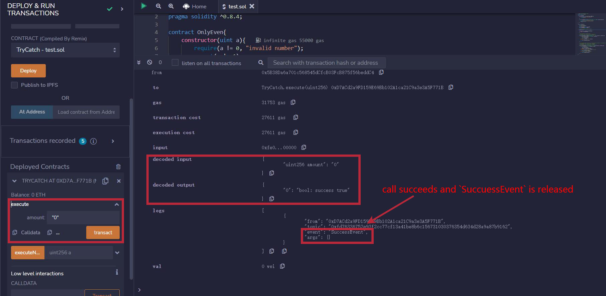
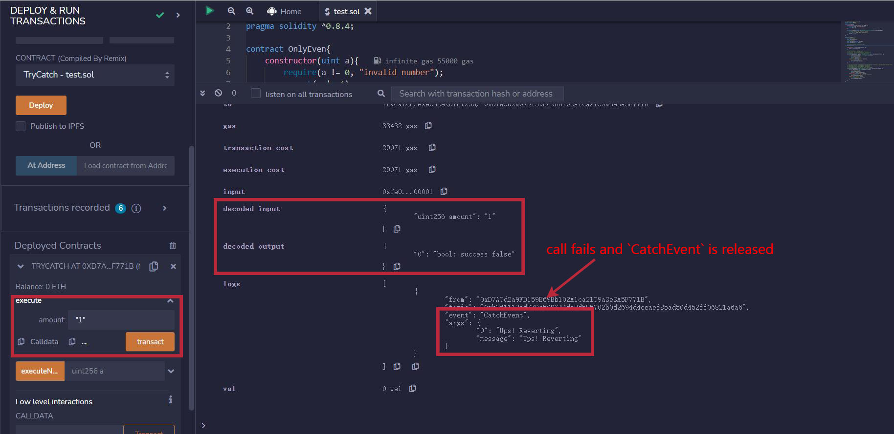
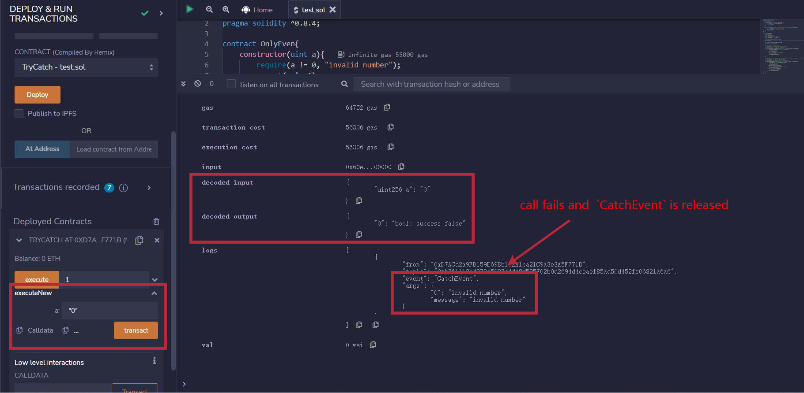
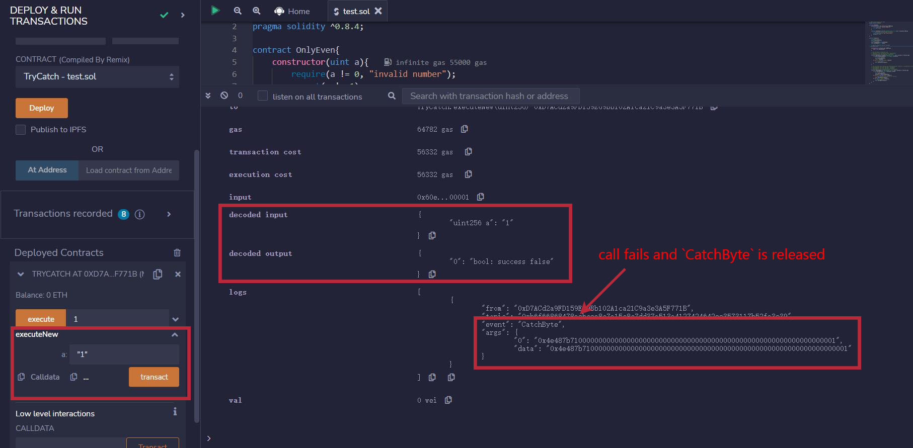
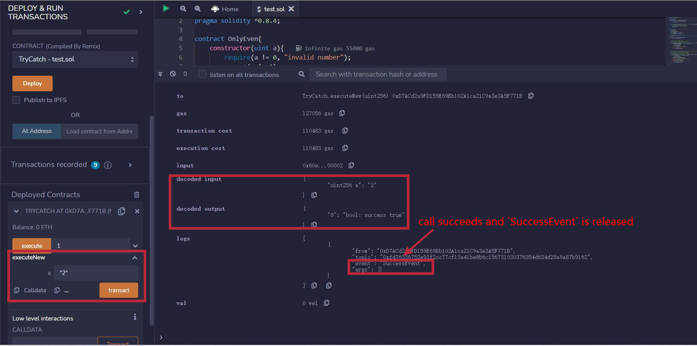

# Solidity Minimalist Tutorial: 30. Try Catch

Recently, I have been revisiting Solidity, consolidating the finer details, and writing "WTF Solidity" tutorials for newbies. 

Twitter: [@0xAA_Science](https://twitter.com/0xAA_Science) | [@WTFAcademy_](https://twitter.com/WTFAcademy_)

Community: [Discord](https://discord.wtf.academy)｜[Wechat](https://docs.google.com/forms/d/e/1FAIpQLSe4KGT8Sh6sJ7hedQRuIYirOoZK_85miz3dw7vA1-YjodgJ-A/viewform?usp=sf_link)｜[Website wtf.academy](https://wtf.academy)

Codes and tutorials are open source on GitHub: [github.com/AmazingAng/WTFSolidity](https://github.com/AmazingAng/WTFSolidity)

-----

`try-catch` is a standard way of handling exceptions that is almost ubiquitous in modern programming languages. Besides, it's added to `solidity`0.6.

In this chapter, we will introduce you how to use `try-catch` to handle exceptions in smart contracts. 

## `try-catch`
In `solidity`, `try-catch` can only be used for `external` function or call `constructor` (considered `external` function) when creating contracts. The basic syntax is as follows:
```solidity
        try externalContract.f() {
            // if call succeeds, run some codes
        } catch {
            // if call fails, run some codes
        }
```
`externalContract.f()` is function call of an external contract, `try` module runs if call succeeds, while `catch` module runs if call fails.

You can also use `this.f()` instead of `externalContract.f()`. `this.f()` is also considered as an external call, but can't be used in constructor because the contract has not been created at that time.

If the called function has a return value, then `returns(returnType val)` must be declared after `try`, and the returned variable can be used in `try` module. In the case of contract creation, the returned value is newly created contract variable.
```solidity
        try externalContract.f() returns(returnType val){
            // if call succeeds, run some codes
        } catch {
            // if call fails, run some codes
        }
```

Besides, `catch` module supports catching special exception causes:

```solidity
        try externalContract.f() returns(returnType){
            // if call succeeds, run some codes
        } catch Error(string memory /*reason*/) {
            // catch revert("reasonString") and require(false, "reasonString")
        } catch Panic(uint /*errorCode*/) {
            // Catch errors caused by Panic, such as assert failures, overflows, division by zero, array access out of bounds
        } catch (bytes memory /*lowLevelData*/) {
            // If a revert occurs and the above two exception types fail to match, it will go into this branch
            // such as revert(), require(false), revert a custom type error
        }
```

## `try-catch` actual combat
### `OnlyEven`
We create an external contract `OnlyEven` and use `try-catch` to handle exceptions:

```solidity
contract OnlyEven{
    constructor(uint a){
        require(a != 0, "invalid number");
        assert(a != 1);
    }

    function onlyEven(uint256 b) external pure returns(bool success){
        // revert when an odd number is entered
        require(b % 2 == 0, "Ups! Reverting");
        success = true;
    }
}
```
`OnlyEven` contract contains a constructor and an `onlyEven` function.

- constructor has one argument `a`, when `a=0`, `require` will throw an exception; When `a=1`, `assert` will throw an exception. All other conditions are normal.
- `onlyEven` function has one argument `b`, when `b` is odd, `require` will throw an exception.

### Handle external function call exceptions
First, define some events and state variables in `TryCatch` contract:
```solidity
    // success event
    event SuccessEvent();

    // failure event
    event CatchEvent(string message);
    event CatchByte(bytes data);

    // declare OnlyEven contract variable
    OnlyEven even;

    constructor() {
        even = new OnlyEven(2);
    }
```
`SuccessEvent` is the event that will be released when call succeeds, while `CatchEvent` and `CatchByte` are the events that will be released when an exception is thrown, corresponding to `require/revert` and `assert` exceptions respectively. `even` is a state variable of `OnlyEven` contract type.

Then we use `try-catch` in `execute` function to handle exception in the call to external function `onlyEven`:

```solidity
    // use try-catch in external call
    function execute(uint amount) external returns (bool success) {
        try even.onlyEven(amount) returns(bool _success){
            // if call succeeds
            emit SuccessEvent();
            return _success;
        } catch Error(string memory reason){
            // if call fails
            emit CatchEvent(reason);
        }
    }
```
### verify on remix

When running `execute(0)`, because `0` is even, satisfy `require(b % 2 == 0, "Ups! Reverting");`, so no exception is thrown. The call succeeds and `SuccessEvent` is released.



When running `execute(1)`, because `1` is odd, doesn't satisfy `require(b % 2 == 0, "Ups! Reverting");`, so exception is thrown. The call fails and `CatchEvent` is released.



### Handle contract creation exceptions

Here we use `try-catch` to handle exceptions when a contract is created. Just need to rewrite `try` module to the creation of `OnlyEven` contract

```solidity
    // use try-catch when creating new contract(Contract creation is considered an external call)
    // executeNew(0) will fail and emit `CatchEvent`
    // executeNew(1) will fail and emit `CatchByte`
    // executeNew(2) will succeed and emit `SuccessEvent`
    function executeNew(uint a) external returns (bool success) {
        try new OnlyEven(a) returns(OnlyEven _even){
            // if call succeeds
            emit SuccessEvent();
            success = _even.onlyEven(a);
        } catch Error(string memory reason) {
            // catch revert("reasonString") and require(false, "reasonString")
            emit CatchEvent(reason);
        } catch (bytes memory reason) {
            // catch assert() of failure, the error type of assert is Panic(uint256) instead of Error(string), so it will go into this branch
            emit CatchByte(reason);
        }
    }
```

### verify on remix

When running `executeNew(0)`, because `0` doesn't satisfy `require(a != 0, "invalid number");`, the call will fail and `CatchEvent` is released.



When running `executeNew(1)`, because `1` doesn't satisfy `assert(a != 1);`, the call will fail and `CatchByte` is released.



When running `executeNew(2)`, because `2` satisfy `require(a != 0, "invalid number");` and `assert(a != 1);`, the call succeeds and `SuccessEvent` is released.



## Summary
In this chapter, we introduced how to use `try-catch` in `solidity` to handle exceptions in the operation of smart contracts.
